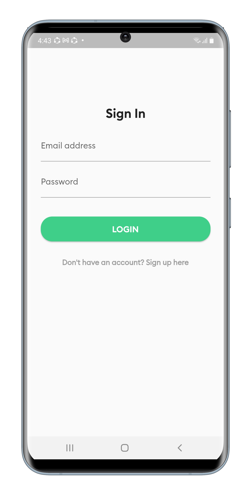
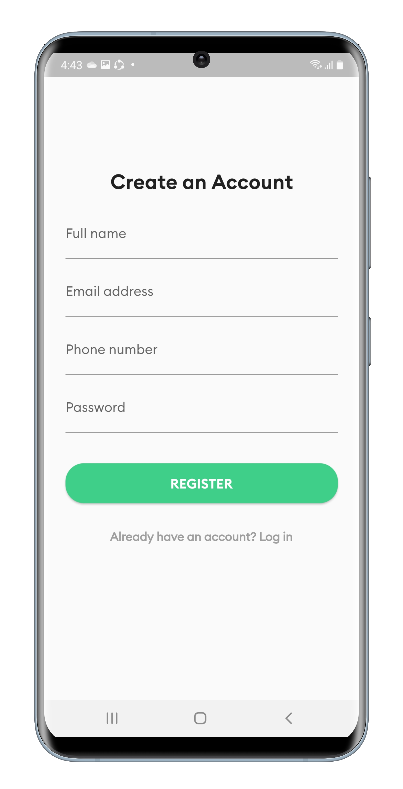
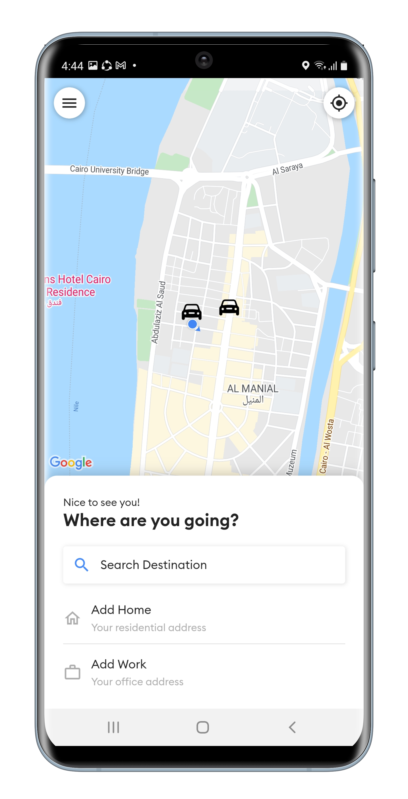
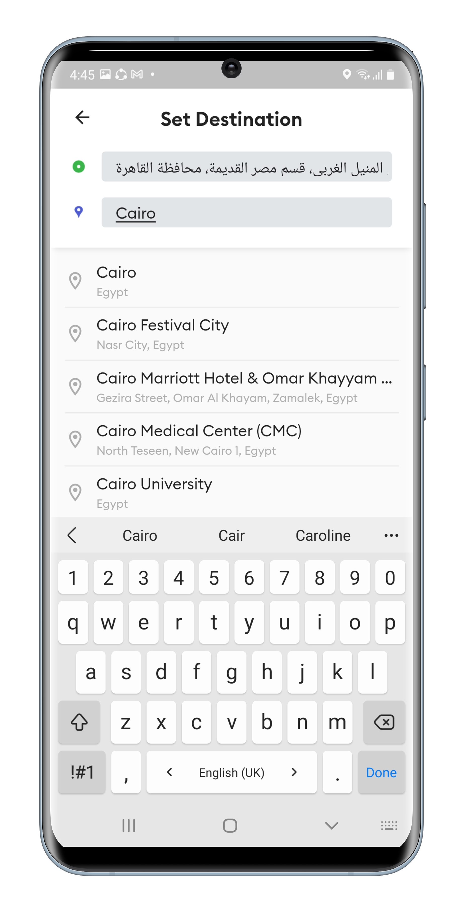
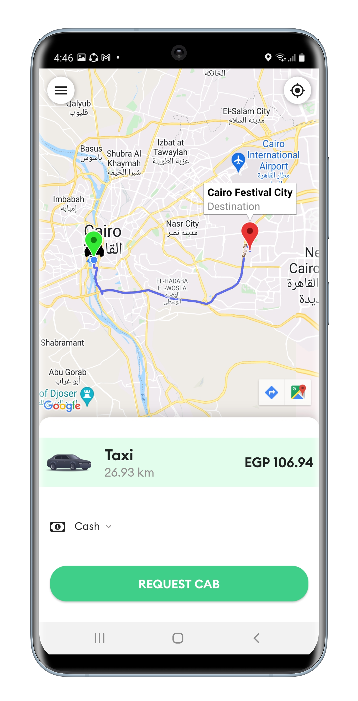
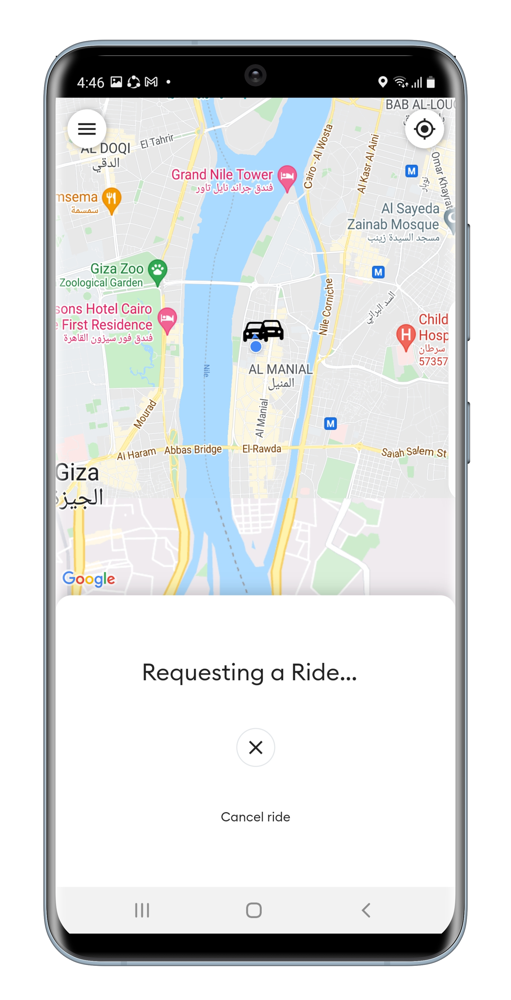
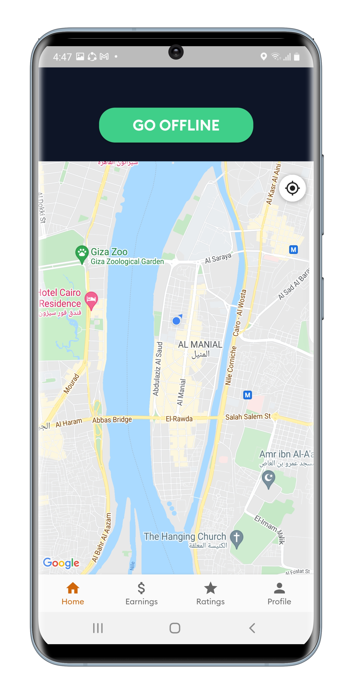
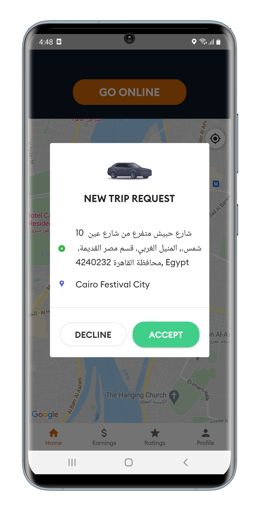
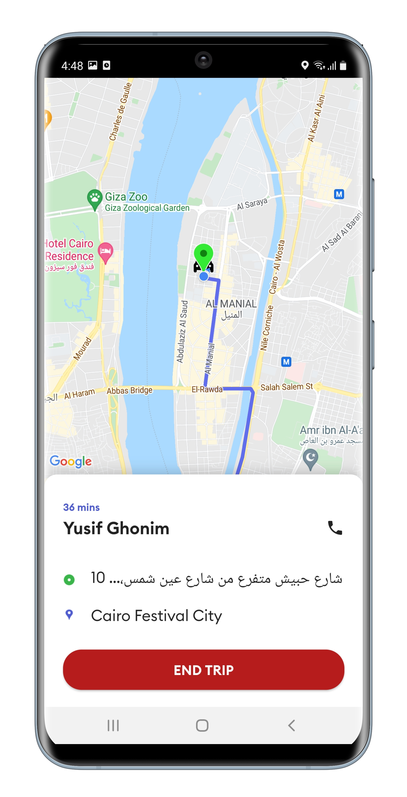
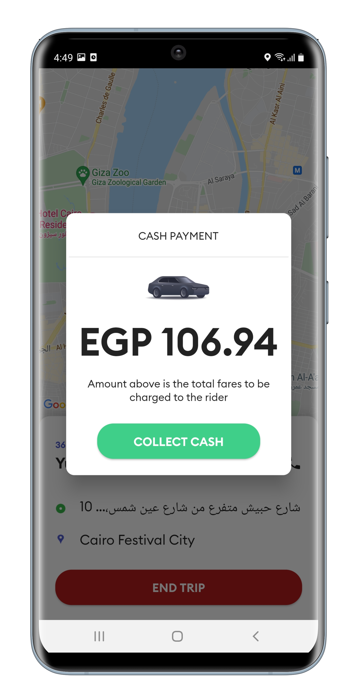

# Taxi (Uber Clone)

This project consists of two apps one for the rider and other for the driver. Taxi was implemented by using Firebase authentication to store user credentials and using Firestore to store both rider's and driver's location. GoogleMaps API was used to get location and direction details. GeoFire package was used to help drivers and riders find each other. Project was made with clean architecture (MVVM) and BLoC as state management.  

## Project Motivation

I wanted to make this project to learn how to connect two apps with the same database, use Google Maps API, create model classes and build it with clean architecture with BLoC and Model View View Model pattern (MVVM).

## Technologies Used

- Dart
- Flutter
- BLoC
- API
- Firebase Authentication 
- Cloud Firestore

 

  
Project Screenshots

  
  
  
  
  
  
  
  
  
  
